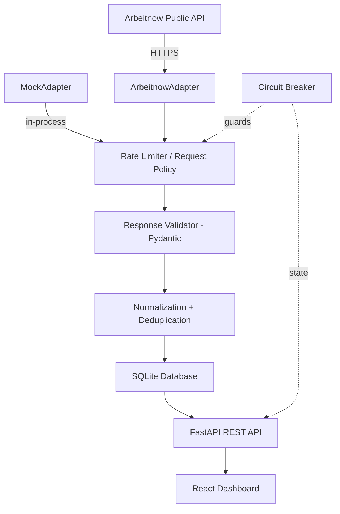

# JobPulse — Resilient Job Ingestion Monitor

A production-quality engineering demo for **Acdyon Technologies Frontend Challenge Part 1**.

JobPulse demonstrates resilient job ingestion from a public API, with a clean engineering dashboard that makes the system's internals visible.

---

## Features

- **Provider-agnostic ingestion** via `JobSource` Protocol — swap sources without changing service code
- **Circuit breaker** (CLOSED → OPEN → HALF_OPEN) protecting against cascading failures
- **Exponential backoff with jitter** on HTTP failures, with `Retry-After` respect
- **Empty-response protection** — source returning zero jobs never overwrites existing data
- **Deduplication** — composite unique key (source + external_id) with content-hash fallback
- **Full observability** — every ingestion run is recorded with metrics (fetched, accepted, dupes, failures, latency)
- **Mock source** with configurable scenarios: normal, empty, rate_limited, server_error, slow, malformed
- **Engineering dashboard** — metrics, source health, circuit breaker state, ingestion history, job listings
- **Skeleton loading, toast notifications, responsive layout** (390px → 1440px)
- **Konami code easter egg** (↑↑↓↓←→←→BA)

---

## Architecture



---

## Tech Stack

| Layer | Technology |
|---|---|
| Backend | Python 3.11, FastAPI, SQLAlchemy, Pydantic v2 |
| HTTP Client | httpx |
| Database | SQLite with WAL mode |
| Frontend | React 18, Vite 8, TypeScript |
| Styling | Tailwind CSS v4, CSS Custom Properties |
| Tests | pytest, pytest-asyncio, respx |
| Deployment | Render (backend), Vercel (frontend) |

---

## Running Locally

```bash
git clone <repo-url>
cd jobpulse
```

### Backend

```bash
cd backend
python -m venv venv
# Windows
venv\Scripts\activate
# macOS/Linux
source venv/bin/activate

pip install -r requirements.txt
cp ../.env.example .env
uvicorn app.main:app --reload
```

API available at `http://localhost:8000`
Swagger docs at `http://localhost:8000/docs`

### Frontend

```bash
cd frontend
npm install
npm run dev
```

Dashboard at `http://localhost:5173`

---

## Testing

```bash
cd backend
pytest -v
```

All tests use in-memory SQLite. The real Arbeitnow API is **never called** during tests.

Test coverage:
- `test_normalization.py` — field normalization, content hashing, tag deduplication
- `test_validation.py` — schema validation for all error cases
- `test_deduplication.py` — all deduplication scenarios
- `test_ingestion.py` — full pipeline integration (mocked sources)
- `test_circuit_breaker.py` — all state machine transitions
- `test_rate_limiter.py` — backoff, jitter, retry, 429, 5xx, timeout
- `test_api.py` — REST endpoints, pagination, filters, health

---

## Environment Variables

| Variable | Default | Description |
|---|---|---|
| `JOB_SOURCE` | `arbeitnow` | Source adapter: `arbeitnow` or `mock` |
| `MOCK_SCENARIO` | `normal` | Mock scenario (when `JOB_SOURCE=mock`): `normal`, `empty`, `rate_limited`, `server_error`, `slow`, `malformed` |
| `DATABASE_URL` | `sqlite:///./jobpulse.db` | SQLAlchemy database URL |
| `CORS_ORIGINS` | `http://localhost:5173` | Comma-separated allowed origins |
| `HTTP_TIMEOUT_SECONDS` | `30.0` | HTTP request timeout |
| `HTTP_MAX_RETRIES` | `3` | Maximum retry attempts |
| `HTTP_INITIAL_BACKOFF_SECONDS` | `1.0` | Initial backoff delay |
| `HTTP_MAX_BACKOFF_SECONDS` | `60.0` | Maximum backoff delay |
| `CIRCUIT_BREAKER_FAILURE_THRESHOLD` | `5` | Failures before opening circuit |
| `CIRCUIT_BREAKER_COOLDOWN_SECONDS` | `60` | Cooldown before HALF_OPEN probe |

---

## Resilience Strategy

### Rate Limiting
- Single request per ingestion run (conservative)
- Configurable HTTP timeout
- Up to `HTTP_MAX_RETRIES` retries on 5xx and timeouts
- Exponential backoff: `min(initial × 2^attempt, max)` + uniform jitter
- `Retry-After` header is parsed and respected on 429 responses
- 429 is NOT retried — it raises `SourceRateLimitedError` immediately

### Circuit Breaker
- `CLOSED`: Normal operation, failures counted
- `OPEN`: Requests blocked. Cached data served. Opens after N consecutive failures.
- `HALF_OPEN`: One probe request allowed after cooldown. Success → CLOSED, Failure → OPEN.
- In-memory (single instance). A distributed system would use Redis.

### Caching / Last Known Good Data
- Empty response → `EMPTY_SOURCE` status, existing jobs preserved
- Schema error → `SCHEMA_ERROR` status, existing jobs preserved
- Source unavailable → `FAILED` status, existing jobs preserved
- Dashboard clearly communicates when data is cached and how old it is

### Deduplication
- Primary key: `(source, external_id)` — composite UNIQUE constraint
- On duplicate: update `last_seen_at` only
- Fallback hash: `SHA-256(company + title + url)` — used when external_id is unstable

---

## Deployment

### Backend → Render

1. Create a new Render **Web Service** pointing to `backend/`
2. Build command: `pip install -r requirements.txt`
3. Start command: `uvicorn app.main:app --host 0.0.0.0 --port $PORT`
4. Add environment variables: `JOB_SOURCE=arbeitnow`, `CORS_ORIGINS=https://your-frontend.vercel.app`
5. **SQLite limitation on Render:** Render's file system is ephemeral. The database resets on every deploy. For production, switch `DATABASE_URL` to a PostgreSQL connection string — no code changes required.

### Frontend → Vercel

1. Import the `frontend/` directory into Vercel
2. Build command: `npm run build`
3. Output directory: `dist`
4. Add environment variable: `VITE_API_URL=https://your-backend.onrender.com`

### Docker (local)

```bash
docker-compose up
```
